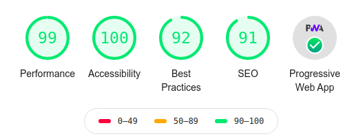

# Nuxt PWA + TWA

A supporting respository for PWA developed in Nuxt.

## Modules:
* nuxtjs/pwa
* nuxtjs/toast
* nuxtjs/robots
* nuxt-twa-module
* lighthouse

## Features:
* PWA support
* TWA support
* Notify updates
* Version code + update time

## To-Do:
- [ ] Online/Offline status page
- [ ] Custom app installation UI
- [x] App version (currently uses package.json)

## Lighthouse Score sheet:

